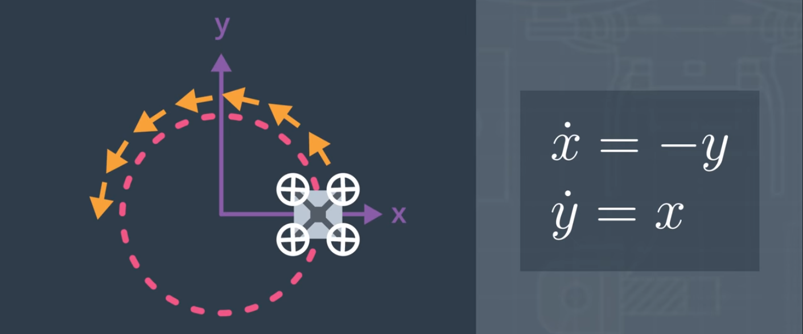

# AAE_Notebook_015_ModelDynamics
In most lessons, thusfar, we've assumed an idealized version of the world and physics. We've assumed that the vehicle always knows where it is in the world as well as knowing where every obstacle is ahead of time. We've even assumed that the vehicle was able to follow a trajectory perfectly through the environment.

In the real world, all of these assumptions break down. The information available in a map, ahead of time, is usually imperfect. Sometimes obstacles appear or are missing from the map at time of flight. Sensor measurements, like GPS, have inherent errors. Environmental conditions, such as wind, can make following a trajectory more challenging. And, finally, all vehicles have constraints on how they move and need be included in your planning and controls.

Restrictions on the states that a vehicle can physical be in are known as kinematic constraints. In other words, these are constraints on motion that aren't a result of force or mass -- generally a function of geometry.

As seen in the picture above, we also have what are known as [differential constraints](https://en.wikipedia.org/wiki/Motion_planning#Differential_constraints). That is, physical constraints of the vehicle. 

Models without such differential constraints are consider holonomic. Vehicles that seem to not have such constraints, such as quadcopters, are known as quasi-holonomic systems.

Thusfar, we've ignored the mass of the vehicle and forces acting on it, like gravity. But, when you include forces in your planning problem, even when there aren't a lot of obstacles in the environment with complicated passages to fly through, you still have to think about issues such as flying slowly enough to have sufficient room to stop and/or manuever when you get close enough to an obstacle or waypoint.

** The attitude of the vehicle determines the direction of the thrust vector; so, you must think about how quickly you can rotate the vehicle so as to accelerate or decelerate. 

The constraints on a vehicle's motions that result from a vehicle's mass and forces acting on it are known as dynamic constraints. Dynamic constraints, generally, show up as a form of differential constraints. 

While there may be other constraints on how a vehicle are able to move, such as the steering mechanism on a car, in this notebook, we're going to look at how to find plans for vehicles that have differential constraints of all kinds.

Pictured: Example of AAV restricted to a circular motion.
